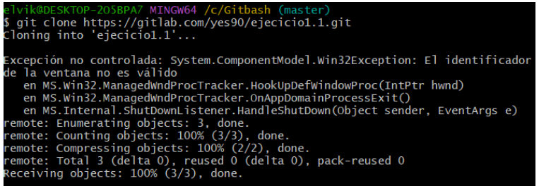

# Ejecicio1
Los deberes de Maximo 
# PRACTICA 1. 
## Ejercicio básico. Parte A
Para añadir un Repositorio debemos crear un repositorio en github, abrir la pestaña code y copiar el enlace  
{width=200 height=100}
Luego lo añadimos al gitbash con el siguiente comando donde después de clone es el link que copiamos 

{width=200 height=100}
Con las siguientes líneas sirven para crear el archivo y subirlo 

{width=200 height=100}

y esta es para meterlo en GitHub
{width=200 height=100}
Con este comando sacamos el archivo de Ghub
{width=200 height=100}
Para volver al estado original de un archivo cuando todavía no se ha hecho add
{width=200 height=100}
Si ya se ha hecho el add y quiero volver a una versión anterior

{width=200 height=100}
## Ejercicio básico. Parte B.
Solo tenemos que repetir exactamente los mismos pasos que en github

{width=200 height=100}
