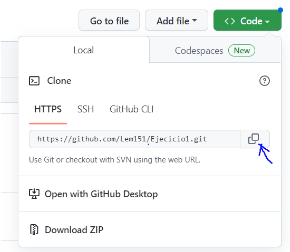
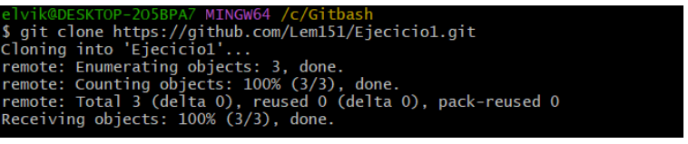
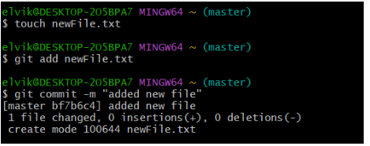
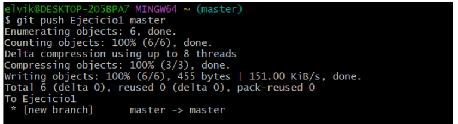
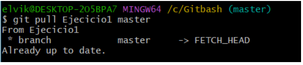
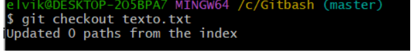
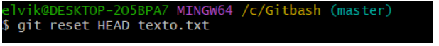

# Ejecicio1
Los deberes de Maximo 
# PRACTICA 1. 
## Ejercicio básico. Parte A
Para añadir un Repositorio debemos crear un repositorio en github, abrir la pestaña code y copiar el enlace  

-------
Luego lo añadimos al gitbash con el siguiente comando donde después de clone es el link que copiamos 

-------
Con las siguientes líneas sirven para crear el archivo y subirlo 

-----
y esta es para meterlo en GitHub

-----
Con este comando sacamos el archivo de Ghub

----
Para volver al estado original de un archivo cuando todavía no se ha hecho add

----
Si ya se ha hecho el add y quiero volver a una versión anterior

----
## Ejercicio básico. Parte B.
Solo tenemos que repetir exactamente los mismos pasos que en github

---
