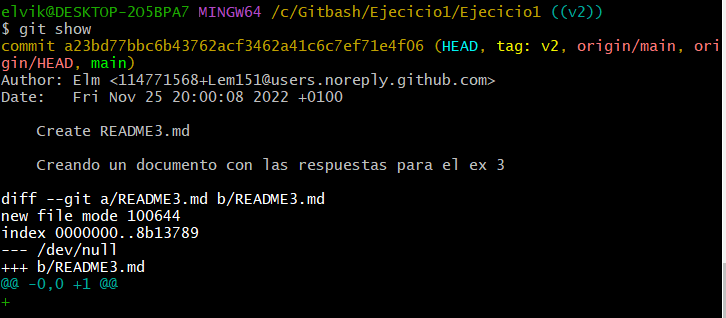

# Ejecicio1
Los deberes de Maximo 
# PRACTICA 3. 
## 1. Etiquetamos el commit primero y el tercero.
-------
Para esto el primer commit será la versión 1 de nuestro proyecto. La etiqueta será v1.
El tercer commit será la versión 2 de nuestro proyecto. La etiqueta será v2.
El segundo commit no será etiquetado.

-------
Si por cualquier motivo nos equivocamos al crear la etiqueta podemos eliminarla con

-------
## 2. Usando etiquetas para movernos
-------
Las etiquetas nos permiten referenciar commits de una forma más cómoda que usando el identificador de hash.
Por ejemplo es más cómodo usar:

-----
## 3. Examinado cambios de un commit respecto al anterior.
-------
Para ver los cambios introducidos respecto al commit anterior hacemos:

-----
Y para ver el cambio realizado en el commit primero respecto al repositorio vacío, hacemos:

----
## 4. Examinado cambios de un commit respecto a varios anteriores.
----
Si deseamos ver todos los cambios realizados a lo largo de varios commits, haremos uso de git diff.
La forma de uso es:

----
## 5. Diferencia entre git show y git diff
----
También podemos hacer

----

